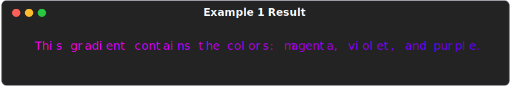

<!DOCTYPE html>
<html>
    <head>
        <meta name="viewport" content="width=device-width, initial-scale=1.0">
    </head>
    <body>
        <picture>
            <source srcset="docs/img/maxgradient_banner.svg" media="(min-width: 800px)">
            <source srcset="docs/img/maxgradient_banner_sq.svg" media="(min-width: 600px)">
            
        </picture>
        <div id="spacer"></div>
        <div class="badges">
            <a href="https://GitHub.com/maxludden/maxgradient"></a>
            <a href="https://GitHub.com/maxludden/maxgradient"></a>
            <a href="https://GitHub.com/maxludden/maxgradient"></a>
            <a href="https://pdm.fming.dev/"></a>
        </div>
        <div id="spacer"></div>
        <div class="gradient-border" id="box">
            <div id="title">MaxGradient</div>
            <p>MaxGradient automates printing gradient colored text to the console. It's built upon the great <a href="https://github.com/Textualize/rich" title="GitHub.com/textualize/rich">rich library</a>. It contains two new Rich Renderables that can be printed by a <a href="https://github.com/Textualize/rich/blob/master/rich/console.py">rich.console.Console</a> object:</p>
            <ul>
                <li><span class="g1">Gradient</span> - A Rich Renderable that prints Text with a gradient of colors to the console.</li>
                <li><span class="g2">GradientRule</span> - A Rich Renderable that prints a horizontal rule to the console in gradient color.</li>
            </ul>
            <p>MaxGradient also expands the <a href="https://github.com/Textualize/rich/blob/master/rich/color.py">rich.color.Color</a> class to include generating colors from CSS3 named colors, as well as 3 digit hex color codes.</p>
            <p>MaxGradient is a work in progress. It is currently in version 0.2.19. It is not yet feature complete, but it is usable. I am currently working on adding more features and improving the code. If you have any suggestions, please feel free to open an issue on <a href="https://GitHub.com/maxludden/maxgradient" title="GitHub.com/maxludden/maxgradient">GitHub</a>.</p>
        </div>
        <div id="spacer"></div>

<h1 class="g1">Installation</h1>

MaxGradient can be installed from PyPi using your favorite python package manager:

<h2><span class="pdm-recommended">PDM (Recommended)</span></h2>

```shell
pdm add maxgradient
```

<h2><span class="pdm-wipe">PIP</span></h2>

```shell
pip install maxgradient
```

<hr>

<h1 class="g1">Usage</h1>

<h2><span class="pdm-wipe">Quick Start</span></h2>

The basic usage of MaxGradient is as a RichRenderable. Like any other RichRenderable, it can be printed to the console using the <span style="color:lime;">print</span><span style="color:#DAF97A;">()</span> method of a <span style="color:lime;">rich</span>.<span style="color:#ffffff;">console</span>.<span style="color:#B8DDEBPus;">Console</span><span class="white">()</span> object.

<h2 class="pdm-wipe">Example</h2>

```python
#imports
from rich.console import Console
from maxgradient import Gradient

console = Console() # Initialize a console
console.print(
    Gradient("Hello, World!", justify="center") # Print a gradient
)
```


<h2><span class="cool-wipe">Gradient with Color</span></h2>

<p>MaxGradient easily make random gradients that require no more than the text you wish to color, it can also be used to make gradients with specific colors. The <span class="green">gradient</span><span class="white">()</span> method takes a string of text as well as a list of colors. The number of colors in the list determines the number of colors in the gradient. The gradient will be evenly distributed between the colors in the list. The gradient will be applied to the text in the order it is given in the list.</p>

<p>MaxGradient accepts the following as </p>
<ul>
    <li>color names (<span style="color:magenta;">magenta</span>, <span style="color:#af00ff;">purple</span>, <span style="color:#5f00ff;">violet</span>, <span style="color:#00f;">blue</span>, <span style="color:rgb(0,85,255);">dogerblue</span>, <span style="color:rgb(0,85,255)">deepskyblue</span>, <span style="color:lightskyblue;">lightskyblue</span>, <span style="color:cyan;">cyan</span>, <span style="color:rgb(0,255,175);">springgreen</span>, <span style="color:#0f0;">lime</span>, <span style="color:rgb(175,255,0);">greenyellow</span>, <span style="color:#ffff00;">yellow</span>, <span style="color:#ffaf00;">orange</span>, <span style="color:#ff5f00;">darkorange</span>, <span style="color:#ff0000;">red</span>, <span style="color:#ff005f;">deeppink</span>, <span style="color:#ff00af;">hotpink</span>)</li>
    <li>hex color codes (3-digit -> <span style="color:#f0f;">#f0f</span>, 6-digit -> <span style="color:#f0f;">#ff00ff</span>)</li>
    <li>rgb color codes</li>
    <li>CSS3 named colors</li>
    <li>as well as any colors from rich's standard library.</li>
</ul>
<p>Let's take a look at some examples:</p>

<h3><span class="g1">Example 1</span></h3>

```python
from rich.conosle import Console
from maxgradient import Gradient

console = Console()

console.print(
    Gradient(
        "This gradient contains the colors: magenta, violet, and purple.",
        colors = [
            "magenta",
            "violet",
            "purple"
        ]
    )
)
```



<br>
    <hr>
<br />

<h3><span class="g2">Example 2</span></h3>

You are not just stuck with ROY G BIV colors, you can use any colors you want. Let's make a gradient with the colors: magenta, violet, purple, dodgerblue, deepskyblue, lightskyblue, and cyan.

```python
console.print(
    Gradient(
        "This gradient contains the colors: magenta, violet, purple, blue, dodgerblue, and cyan.",
        colors = [
            "rgb(255,0,255)", # rgb | magenta
            "violet", # named (#af00ff)
            "#5f00ff", # hex | purple
            "blue", # another named
            "rgb(0,85,255)", # rgb | dodWilWgerblue
            "cyan" # and another
        ]
    )
)
```

<hr>
<div class="verticle_spacer"></div>

<hr>
<h2><span class="g1">Gradient Rule</span></h2>
<p>MaxGradient also includes a GradientRule. The GradientRule is a Rich Renderable that prints a horizontal rule to the console in gradient color. It can be used to separate sections of text in a gradient colored console output.</p>
<p>The GradientRule is currently initialized with random colors and does not at the momement allow for custimization of these colors.</p>
<p>It does however allow the user to specify the thickness of the rule. The thickness is specified by the <span class="g2">thickness</span> keyword argument. The thickeness can be specified as the <span class="g2"><code>'thin'</code></span>, <span class="g2"><code>'medium'</code></span>, or <span class="g2"><code>'thick'</code></span></pre>. The default thickness is 'medium'.</p>


```python
from rich.console import Console
from maxgradient import GradientRule

console = Console()
console.print("[u b #ffffff]Rule Examples[/]", justify="center")
console.line()
console.print(GradientRule(title=f"{title}", thickness="thin", align="left"))
console.line()
console.print(
    GradientRule(
        title="Thin Gradient Rule",
        gradient=True,
        thickness="thin",
        align="center",
    )
)
console.line()
console.print(
    GradientRule(title="Medium Gradient Rule", gradient=True, align="right")
)
console.line()
console.print(
    GradientRule(
        title="Medium Left-aligned Non-gradient Rule",
        gradient=False,
        thickness="medium",
        align="left",
    )
)
console.line()
console.print(
    GradientRule(title="Medium Right-aligned Gradient Rule", align="right")
)
console.line()
console.print(GradientRule("Thick Gradient Rule", thickness="thick"))
```


<hr>
<div style="margin:auto; text-align:center;">
    <span class="g2" style="font-size:2em;">Created by<br /></span>
    <a href="https://GitHub.com/maxludden" >
        <br /><span style="font-family:Urbanist-Thin;font-size:1em;vertical-align:middle;">Max Ludden</span>
    </a>
</div>
<hr>
</body>
