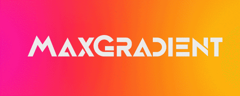

<html>
<<<<<<< HEAD
    <head>
        <link href="gradient.css" rel="stylesheet">
        <title>README</title>
    </head>
    <body>

=======
<head>
    <link href="gradient.css" rel="stylesheet">
    <link href="transition.css" rel="stylesheet">
</head>


>>>>>>> 3c979ed (gradient text animation)
<div class="badges">
    <a href="https://GitHub.com/maxludden/maxgradient">
        
    </a>
    <a href="https://GitHub.com/maxludden/maxgradient">
        
    </a>
    <a href="https://GitHub.com/maxludden/maxgradient">
        
    </a>
    <a href="https://pdm.fming.dev/">
        
    </a>
</div>
<<<<<<< HEAD
<h2 class="cool">MaxGradient</h2>
=======

<h2 class="rainbow-wipe">MaxGradient</h2>
>>>>>>> 3c979ed (gradient text animation)

MaxGradient automating printing gradient colored text to the console. It's built upon the great [rich library](http://rich.readthedocs.io/en/latest/).

<<<<<<< HEAD
# Installation #

MaxGradient can be installed from PyPi using your favorite package manager:

<h3 class="pdm">PDM
    <span class="recommended"> (Recommended)</span>
</h3>

```shell
pdm add maxgradient
```
=======
<h2 class="green-wipe">Installation</h2><br>
 MaxGradient can be installed from PyPi using your favorite package manager:
<h3 class="pdm">PDM<span class="recommended"> (Recommended)</span></h3>
<pre>
<code>
    <span class="pdm-wipe">pdm </span><span class="light">add </span> <span class="rainbow-wipe">maxgradient</span>
</code>
</pre>

<h3 class="blue-wipe">Pip</h3>

<pre>
<code>
    <span class="green-wipe">pip</span> install <span class="rainbow-wipe">maxgradient</span>
</code>
</pre>

<h2 class="warm-wipe">Usage</span>
>>>>>>> 3c979ed (gradient text animation)

## Pip ##

```shell
 pip install maxgradient
```

# Usage #

## Basic Usage ##

The basic usage is to create a console object and use it to print gradient text:

<<<<<<< HEAD
```python
import maxgradient as mg
=======
<pre>
    <code>
    import <span class="rainbow-wipe">maxgradient</span> as mg
>>>>>>> 3c979ed (gradient text animation)

console = mg.Console()
console.gradient("Hello, World!")
```


## Gradient ##

You may also instantiate a Gradient Object. The <span class="warm-wipe">Gradient </span>class is a subclass of the<span class="cool-wipe"> rich.text.Text</span> class, and can be used in the same way. The <span class="warm-wipe">Gradient</span> class has a
few extra arguments available though.

```python
class Gradient(rich.rich.Text):
    """Text with gradient color / style."""
    def __init__ (
        ext: Optional[str | Text] = "",
        colors: Optional[List[Color | Tuple | str]] = None,
        rainbow: bool = False,
        invert: bool = False,
        hues: Optional[int] = None,
        color_sample: bool = False,
        style: StyleType = Style.null(),
        *,
        # The arguments below are used directly by Text
        # so I won't cover them here. If you have questions,
        # check out the rich documentation.
        justify: Optional[JustifyMethod] = None,
        overflow: Optional[OverflowMethod] = None,
        no_wrap: Optional[bool] = None,
        end: str = "\n",
        tab_size: Optional[int] = 8,
        spans: Optional[List[Span]] = None,) -> None:
```

The Gradient class can utilize the above arguments to get a plethora of different gradients.


<<<<<<< HEAD
## Color ##

The final main component of <span class="code-3">MaxGradient</span> is expanding the <span class="class">rich.color.Color</span> class. The <span class="code-3">MaxGradient </span>.<span class="class">Color</span> class can still parse and utilize <span class="class">rich.color.Color</span>'s <a href="https://rich.readthedocs.io/en/latest/appendix/colors.html" alt="Rich Standard Colors">standard colors</a> but in addition to Hex and RGB colors, it can also parse RGB Tuples as well as X11 color names. I've also included the colors that <span class="code-3">MaxGradient</span> uses to create random gradients from for convenience. The follow are the available named colors as well as there hex and rgb colors:


## Example ##
=======
<br><br><hr><br>

## Color

The final main component of <span class="warm-wipe">MaxGradient</span> is expanding the <span class="cool-wipe">rich.color.Color</span> class. The <span class="warm-wipe">MaxGradient </span>.<span class="cool-wipe">Color</span> class can still parse and utilize the <span class="cool-wipe">rich.color.Color</span>'s <a href="https://rich.readthedocs.io/en/latest/appendix/colors.html" alt="Rich Standard Colors">standard colors</a> but in addition to Hex and RGB colors, it can also parse RGB Tuples as well as X11 color names. I've also included the colors that <span class="warm-wipe">MaxGradient</span> uses to create random gradients from for convenience. The follow are the available named colors as well as there hex and rgb colors:


<h3 class="green-wipe">Example</h3>
<pre>
    <code>
import maxgradient as mg
>>>>>>> 3c979ed (gradient text animation)

```python
import maxgradient as mg
console = mg.Console()
console.print("[bold lime]This is a a vibrant green color!")
<<<<<<< HEAD

```


</body>
=======
    </code>
</pre>

>>>>>>> 3c979ed (gradient text animation)
