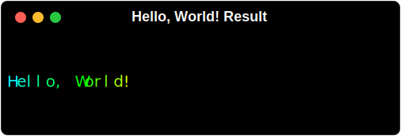
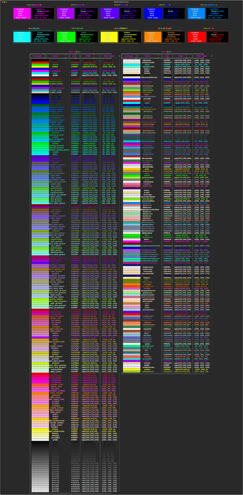

<html>
    <head>
        <link href="styles/gradient.css" rel="stylesheet">
    </head>
    <body>
        <!--MaxGradient Banner-->
        
        <!--End of Banner-->
​        <div class="badges">
​            <a href="https://GitHub.com/maxludden/maxgradient"></a>
​            <a href="https://GitHub.com/maxludden/maxgradient"></a>
​            <a href="https://GitHub.com/maxludden/maxgradient"></a>
​            <a href="https://pdm.fming.dev/"></a>
​        </div>
        <!--End of badges-->
​        <div class="summary">
            <p><span class="mg">MaxGradient</span> automates the printing gradient colored text to the console. It's built upon the great <a href="https://rich.readthedocs.io/en/latest/introduction.html"> <span class="warm-wipe">rich library</span></a>. It contains a Console that can serve as a drop in replacement for <span class="lightblue-cyan-wipe">rich.rich.Console</span> and has an expanded Color class which can parse X11 color names on top of rich's standard colors. <span class="mg">MaxGradient</span> is a work in progress and I'm open to any suggestions or contributions.</span></p>
        </div>
​        <div class="body">

## Installation

<div class="section">
    <p><span class="mg">MaxGradient</span> can be installed from PyPi using your favorite package manager:</p>

### PDM <span class="recommend">(Recommended)</span></h3>

```shell
pdm add maxgradient
```

### Pip

```shell
pip install maxgradient
```

## Usage

### Basic Usage

<div class="section">
    <p>The basic usage is to create a console object and use it to print gradient text:</p>

```python
import maxgradient as mg

console = mg.Console()
console.gradient("Hello, World!")
```



---

## <span class="cool-wipe-header">Gradient</span>

<div class="section">
    <p>You may also instantiate a Gradient Object. The <span class="red-magenta-wipe">Gradient </span>class is a subclass of the<span class="lightblue-cyan-wipe"> rich.text.Text</span> class, and can be used in the same way. The <span class="magenta-violet-wipe">Gradient</span> class has a few extra arguments available though.<p>

```python
class Gradient(rich.rich.Text):
    """Text with gradient color / style."""

    def __init__ (
        ext: Optional[str | Text] = "",
        colors: Optional[str|List[Color | Tuple | str]] = None,
        rainbow: bool = False,
        invert: bool = False,
        hues: Optional[int] = None,
        color_sample: bool = False,
        style: StyleType = Style.null(),
        *,
        # The arguments below are used directly by Text
        # so I won't cover them here. If you have
        # questions check out the rich documentation.
        justify: Optional[JustifyMethod] = None,
        overflow: Optional[OverflowMethod] = None,
        no_wrap: Optional[bool] = None,
        end: str = "\n",
        tab_size: Optional[int] = 8,
        spans: Optional[List[Span]] = None,) -> None:
```

The Gradient class can utilize the above arguments to get a plethora of different gradients.

<a href="Images/gradient_examples.svg" target="_blank">
  
</a>

<br><br><hr><br>

## Color

The final main component of <span class="violet-purple-wipe">MaxGradient</span> is expanding the <span class="purple-blue-wipe">rich.color.Color</span> class. The <span class="rainbow-wipe">MaxGradient </span>.<span class="lightblue-cyan-wipe">Color</span> class can still parse and utilize the <span class="cyan-green-wipe">rich.color.Color</span>'s <a class="green-yellow-wipe" href="https://rich.readthedocs.io/en/latest/appendix/colors.html" alt="Rich Standard Colors">standard colors</a> but in addition to Hex and RGB colors, it can also parse RGB Tuples as well as X11 color names. I've also included the colors that <span class="rainbow-wipe">MaxGradient</span> uses to create random gradients from for convenience. The follow are the available named colors as well as there hex and rgb colors:



### Color Examples

```python
import maxgradient as mg

console = mg.Console()
console.print("[bold green]This is a a vibrant green color!")
```


### Changelog v1.0.6

- Added docs
- Changed docs to readthedocs theme.
</body>
</html>
