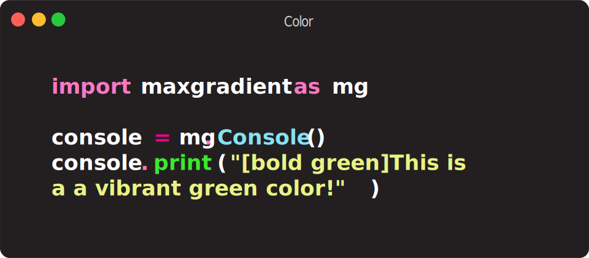

<html>
    <head>
        <link href="styles/style.css" rel="stylesheet">
    </head>
    <body>
        <!--MaxGradient Banner-->
        
        <!--End of Banner-->
​        

​            
​            
​            
​            
​        

        <!--End of badges-->
​        

            
MaxGradient automates the printing gradient colored text to the console. It's built upon the great <a href="https://rich.readthedocs.io/en/latest/introduction.html"> rich library</a>. It contains a Console that can serve as a drop in replacement for rich.rich.Console and has an expanded Color class which can parse X11 color names on top of rich's standard colors. MaxGradient is a work in progress and I'm open to any suggestions or contributions.

        

​        

## Installation

    
MaxGradient can be installed from PyPi using your favorite package manager:

### PDM (Recommended)</h3>

### Pip

## Usage

### Basic Usage

    
The basic usage is to create a console object and use it to print gradient text:

---

## Gradient

    
You may also instantiate a Gradient Object. The Gradient class is a subclass of the rich.text.Text class, and can be used in the same way. The Gradient class has a few extra arguments available though.

The Gradient class can utilize the above arguments to get a plethora of different gradients.

## Color

The final main component of MaxGradient is expanding the rich.color.Color class. The MaxGradient .Color class can still parse and utilize the rich.color.Color's <a class="green-yellow-wipe" href="https://rich.readthedocs.io/en/latest/appendix/colors.html" alt="Rich Standard Colors">standard colors</a> but in addition to Hex and RGB colors, it can also parse RGB Tuples as well as X11 color names. I've also included the colors that MaxGradient uses to create random gradients from for convenience. The follow are the available named colors as well as there hex and rgb colors:

### Color Examples

   
<figure style="display:flex;align-content:center;">
    
Created by

    
</figure>

## Changelog

### v0.2.9 | Updated Banner

- Updated MaxGradient Logo and Favicon
- Updated banner to include new logo as http rather than refernceing the svg file locally.

### v0.2.8 | Fixed `cli.py`

- Fixed `cli.py` so that it works with the new `gradient` method
- Removed logging

### v0.2.7 | Bug Fixes

- Combined multiple CSS stylesheets into one:
    - `next-btn.css` -> `style.css`
    - `gradient.css` -> `style.css`
- General corrections to every file after correcting for Mypy

### v0.2.6 | Type Stubs

- Added type stubs - Mypy should work now
- Simplified `maxgradient.log.py` and fixed line lengths

### v0.2.5 | Renamed Files

- Removed erroneous `maxgradient._console.py` file
- Renamed several files:
    - `maxgradient._gc.py` -> `maxgradient._gradient_color.py`
    - `maxgradient._hex.py` -> `maxgradient._hex_color.py`
    - `maxgradient._rgb.py` -> `maxgradient._rgb_color.py`
    - `maxgradient._x11.py` -> `maxgradient._x11_color`
    - `maxgradient._rich.py` -> `maxgradient._rich_color.py`

### v0.2.4 | Converted to linting with [`ruff`](https://docs.astral.sh/ruff/)

- Rewrote `MaxGradient.console.Console` to replicate `rich.console.Console`
    - added `gradient` method
    - added `gradient_rule` method
- Switched to [`ruff`](https://docs.astral.sh/ruff/) for linting
- Pruned dependencies
- Updated default_styles.GRADIENT_STYLES

### v0.2.3

- Updated docs and added more examples and reference
- Fixed bugs
    - Fixed bug where gradient would not print if gradient was the only thing in the console
    - Fixed bug where gradient wouldn't print if the style wasn't a `rich.style.Style` object

### v0.2.2

- Added examples to docs and fixed some typos and bugs
- Disabled logging
- Fixed gradient class
- Added gradient rules

### v0.1.6

- Added docs
- Changed docs to readthedocs theme.

</body>
</html>
