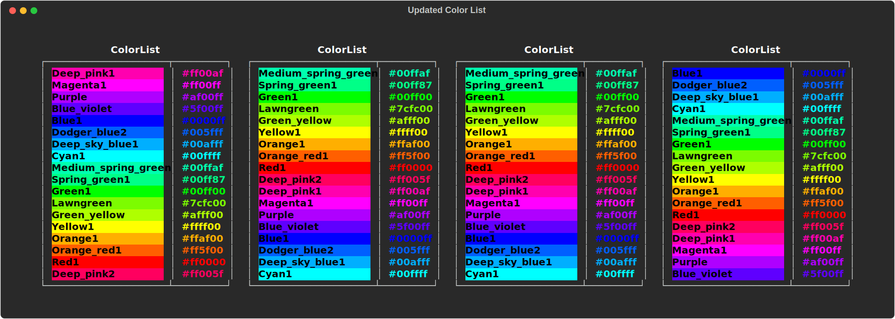

# Changelog

## v0.2.18

<span class="highlight">January 16, 2024</span> | Created TypeAlias `GradientColors`

### <u>Version Changes</u>

- Added `GradientColors`, a  TypeAlias for use in `maxgradient.gradient.Gradient`:
  ```python
  GradientColors: TypeAlias = Union[
      List[Color],
      List[ColorTriplet],
      List[RichColor],
      List[str],
      List[Tuple[int,int,int]]
  ]
  ```
  Which changes the `Gradient` class.:
  ```python
  def __init__(
        self,
        text: Optional[str | Text] = "",
        colors: Optional[GradientColors] = None, # <--- Here
        rainbow: bool = False,
        hues: Optional[int] = None,
        style: StyleType = Style.null(),
        verbose: bool = False,
        *,
        justify: Optional[JustifyMethod] = None,
        overflow: Optional[OverflowMethod] = None,
        no_wrap: Optional[bool] = None,
        end: str = "\n",
        tab_size: Optional[int] = 4,
        spans: Optional[List[Span]] = None,
    ) -> None:
  ```
  
  So now you can specify colors outside of constructor:
  ```python
  console = Console(record=True, width=80)

  colors=["red", "orange", "yellow", "green", "cyan"]

  gradient = Gradient(
      "Gradients are awesome!",
      colors=color,
      justify="center",
      style="bold",
  )
  console.print(
      Panel(
          gradient,
          title="Example",
          expand=False,
          border_style="bold #ffffff",
          padding=(1,4),
          width=35
      ),
      justify='center'
  )
  ```
  

## v0.2.17

<span class="highlight">January 6, 2024</span> | SRC Layout and New GradientColors and ColorList

### <u>Version Changes</u>

- Changed layout to src
- Ran tests and fixed conflicts
- Added `__init__.py` to `maxgradient` directory

###  `GradientColor`

- Rewrote `_gradient_color.GradientColor`:
    - Added 8 more colors bringing the the total to 18:
        

### `ColorList`

- Rewrote ColorList:
    - Added the missing colors from GradientColor bringing the total to 18
    - Updated examples and exported the SVG:



### Color

- Fixed `color.Color` so that it works with the new `GradientColor` and `ColorList` classes

### <u>Dependancy Updates</u>
- Updated `rich` to v10.6.0
- Updated `pydantic` to v1.9.0
- Updated `pytest` to v6.2.5

## v0.2.16

<span class="highlight">January 3, 2024</span> | Reverted to v0.2.14

- Reverted to v0.2.14

### <u>Version Changes</u>
- Added themes.py to mirror rich's themes.py
- Bug fixes for gradient.py and console.py

## v0.2.15 

<span class="highlight">January 2, 2024</span> | Fixed Gradient and Updated Dependencies

- Fixed gradient so that it works with the latest version of `rich`
- Updated dependancies to latest versions

## v0.2.14

<span class="highlight">December 18, 2023</span> | Updated dependancies

- Updated and locked dependancies to latest versions
- Added ruff configuration file

## v0.2.13

<span class="highlight">December 5, 2023</span> | Allowed arbitrary types for console

- I was allowed arbitrary pydantic types for the console class

## v0.2.12

<span class="highlight">December 1, 2023</span> | Added Tests

- Updated banner image for `README.md` and `docs/index.md`
- Seperated Changelog into its own file: `docs/CHANGELOG.md`
- Added `py.typed` file to project                    directory

## v0.2.11

<span class="highlight">November 28, 2023</span> | Added Tests

- Removed color_sample and invert from gradient attributes
- Added tests for console, color, and gradient

## v0.2.10

<span class="highlight">November 25, 2023</span> | Added Dates

- Updated changlog to have dates
- added logo and favicon to changelog

## v0.2.9

<span class="highlight">November 25, 2023</span> | Updated Banner

- Updated MaxGradient Logo and Favicon
- Updated banner to include new logo as http rather than referencing the SVG file locally.

## v0.2.8

<span class="highlight">November 25, 2023</span> | Fixed `cli.py`

- Fixed `cli.py` so that it works with the new `gradient` method
- Removed logging

## v0.2.7

<span class="highlight">November 25, 2023</span> | Bug Fixes

- Combined multiple CSS stylesheets into one:
    - `next-btn.css` -> `style.css`
    - `gradient.css` -> `style.css`
- General corrections to every file after correcting for Mypy

## v0.2.6

<span class="highlight">November 18, 2023</span> | Type Stubs

- Added type stubs - Mypy should work now
- Simplified `maxgradient.log.py` and fixed line lengths

## v0.2.4

- Rewrote `MaxGradient.console.Console` to replicate `rich.console.Console`
    - added `gradient` method
    - added `gradient_rule` method
- Switched to [`ruff`](https://docs.astral.sh/ruff/) for linting
- Pruned dependencies
- Updated default_styles.GRADIENT_STYLES

## v0.2.3

- Updated docs and added more examples and reference
- Fixed bugs
    - Fixed bug where gradient would not print if gradient was the only thing in the console
    - Fixed bug where gradient wouldn't print if the style wasn't a `rich.style.Style` object

## v0.2.2

- Added examples to docs and fixed some typos and bugs
- Disabled logging
- Fixed gradient class
- Added gradient rules
