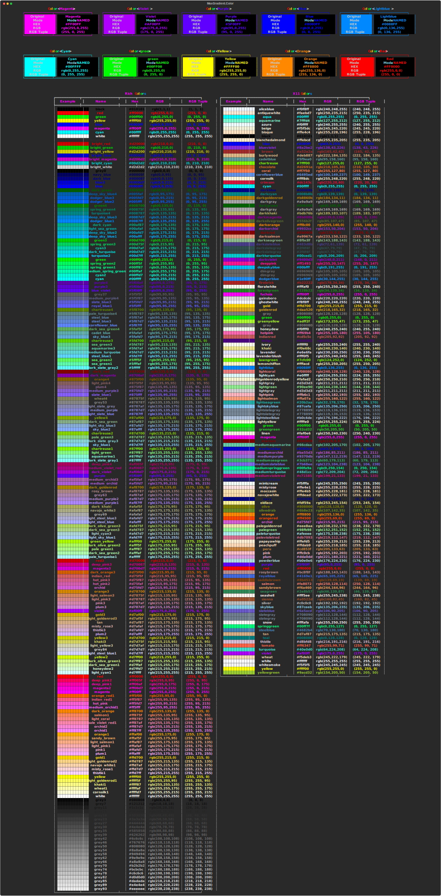

# <span class="rainbow-wipe">MaxGradient.Color</span>

Color extends the [Rich.color.Color](https://github.com/Textualize/rich/blob/master/rich/color.py) class to allow colors to be parsed from:

- [X11](https://www.w3schools.com/colors/colors_x11.asp) color names (over 200 colors)
- Rich's [Standard Color Library](https://rich.readthedocs.io/en/latest/appendix/colors.html)
- Hex codes (3-digit and 6-digit)
- RGB values (with or without the 'rgb' prefix)

A color can be represented as a string in numerous ways. The easiest is the name of the color:

- <span style="color:#f00;">red</span>
- <span style="color:#f0f;">magenta</span>
- <span style="color:#00f;">blue</span>

You can also use the hex code of the color:

- <span style="color:#f00;">#ff0000</span> (six digit hex code)
- <span style="color:#f0f;">#f0f</span> (three digit hex code)

Or the rgb values of the color:

- <span style="color:#050;">rgb(0,85,0)</span> (with `rgb` prefix)
- <span style="background:#0f0;">(0, 255, 0)</span> (`rgb` tuple without prefix)

In addition to common names, MaxGradient also supports the entire rich color standard color palette. But we didn't stop there, in addition to rich's standard library, MaxGradient also supports the entire X11 color palette. That's over 200 colors!

## Example 1: <span style="color:#ff0000;">Color("red")</span>

```python
from maxgradient import Color, Console

console = Console()
console.print(
    Color("red"),
    justify="center"
)
```


## Example 2: <span style="background-color:#AAFFAA;"> Color("#AAFFAA") </span>

```python
console.print(
    Color("#aaffaa"),
    justify = "center"
)
```


## Example 3: <span style="color:darkOrchid;">Color("DarkOrchid")</span>

```python
console.print(
    Color("DarkOrchid"),
    justify = "center"
)
```


## Possible Colors

To view all of the available colors run the following command in the console:

```shell
python -m maxgradient.color
```


