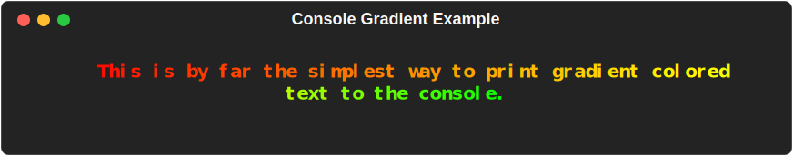
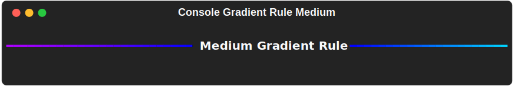

# Console

MaxGradient.console.Console() is a subclass of rich.console.Console() that adds gradient functionality to the console. Just it can be instantiated in multiple ways:

**Directly:**

```python
from maxgradient import Console

console = Console()
console.print("[bold lime]Hello, World![/]")
```


## New Methods

Console also has two new methods that you can take advantage of in your projects:

### First New Method

#### <span class="class-type">Console</span>.<span class="classmethod">gradient</span>()

There's and low level look at `MaxGradient.gradient.Gradient`'s class in the next section. For now, just know that any of the parameters that can be used by [`MaxGradient.gradient.Gradient()`](gradient_ref.md) can also be used by `console.gradient()`.

#### Example

```python
console.gradient(
    "This is by far the simplest way to print \
        gradient colored text to the console.",
    colors = [
        "red",
        "orange",
        "yellow",
        "green"
    ],
    justify = "center",
    style = "bold"
)
```



---

### Second New Method

#### <span class="class-type">Console</span>.<span class="classmethod">gradient_rule</span>()

`Console.gradient_rule()` expands on `rich.rule.Rule()` by allowing you to specify both the colors of the rule's gradient, as well as the rule's thickness.

### Examples

#### Gradient Rule

```python
from maxgradient.console import Console

console = Console()
console.gradient_rule("Medium Gradient Rule")
```


