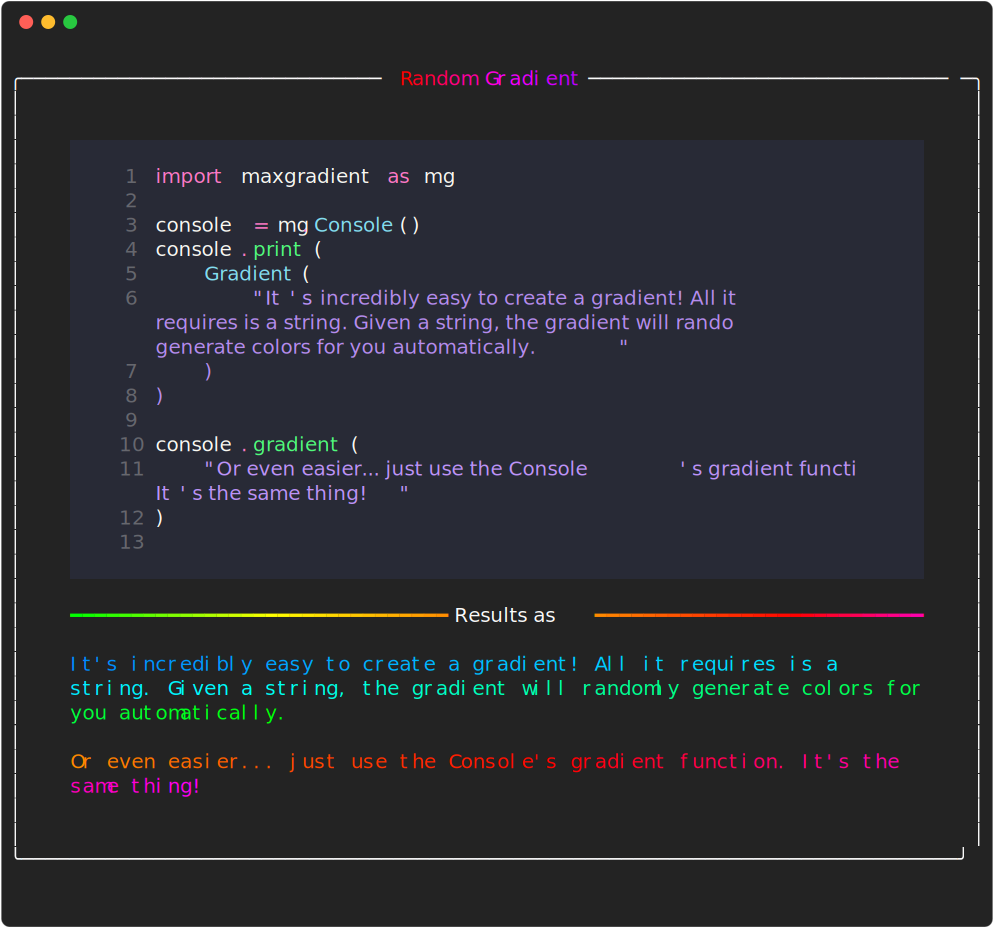
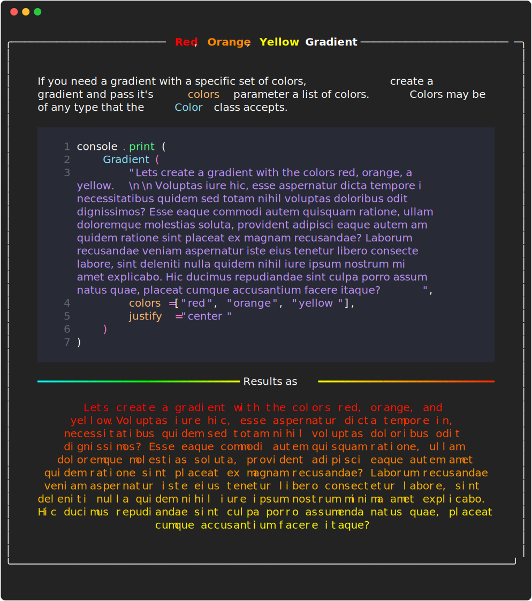

# <span class="rainbow-wipe">MaxGradient.Gradient</span>

Maxgradient.gradient.Gradient is a subclass of [rich.text.Text](https://github.com/Textualize/rich/blob/master/rich/text.py), and can be used in the same way. If a gradient is made with just a string, the gradient will automatically generate colors for you. If that's not colorful enough for you, you can pass the rainbow argument to the gradient to generate a rainbow gradient.

If you need more control over the gradient, you can pass a list of colors to the gradient. The gradient will be evenly distributed between the colors in the list. The gradient will be applied to the text in the order it is given in the list.

## Example 1: Random Gradient

You need very little code to create a gradient with random colors. Just pass a string to the gradient and you're done.

```python
from rich.console import Console
from maxgradient.gradient import Gradient

console = Console()

console.print(Gradient("Hello, World!" justify="center"))
```

---


## Example 2: Rainbow Gradient



## Example 3: Gradient with Specified Colors


