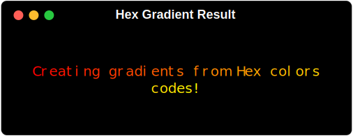

# MaxGradient.Gradient


Gradient is a subclass of rich.text.Text, and can be used in the same way. The Gradient class however also incorporates maxgradient.color.Color which is an expanded version of rich.color.Color. Gradient can be used to create a gradient of colors or styles. Gradient can also be used to create a rainbow effect, or to invert the colors of the gradient.

## Basic Usage

Gradient has a number of arguments that can be used to create a variety of different gradients. However, as demonstrated below, the most basic usage is simply to pass gradient text. If no colors are provided to gradient, it will randomly generate a gradient of colors for you.

```python
from maxgradient import Console, Gradient

console = Console()
console.print(Gradient("Gradients are cool!"))
```


## Colors

To get a bit fancier, you can chose the colors of your gradient by passing a list of colors to the gradient. The colors can be any of the following:

### Strings

A color can be represented as a string in numerous was. The easiest is the name of the color:

- <span style="color:#f00;">red</span>
- <span style="color:#ff0;">yellow</span>
- <span style="color:#00ff00;">green</span>

You can also use the hex code of the color:

- <span style="color:#f00;">#ff0000</span><span style="font-weight:100;font-size:.7em;color:#fcc"> (six digit hex code)</span>
- <span style="color:#ff0;">#ff0</span><span style="font-weight:100;font-size:.7em;color:#ffc"> (three digit hex code)

Or the rgb values of the color:

- <span style="color:#f00;">rgb(255, 0, 0)</span><span style="font-weight:100;font-size:.7em;color:#fcc"> (with 'rgb' prefix)</span>
- <span style="color:#0f0;">(0, 255, 0)</span><span style="font-weight:100;font-size:.7em;color:#cfc;"> ('rgb' tuple without prefix)</span>

In addition to common names, MaxGradient also supports the entire rich color standard color palette. But we didn't stop there, in addition to rich's standard library, MaxGradient also supports the entire X11 color palette. That's over 200 colors!

A complete list of the supported colors can be viewed in the console by running the following command:

```shell
python -m maxgradient.color
```

#### Examples

```python
from maxgradient import Console, Gradient
console = Console()
console.print(Gradient("Creating gradients from strings!", colors=["red", "green", "blue"]))
```


```python
console.print(
    Gradient(
        "Creating gradients from hex codes!",
        colors=["#ff0000", "#ff8800", "#ff0"],
    )
)
```



```python
console.print(
    Gradient(
        "Creating gradients from rgb values!",
        colors=[
            "rgb(255, 0, 0)", # rgb prefix
            "(255, 136, 0)",  # rgb tuple without prefix
            "rgb(255, 255, 0)"
        ],
    )
)
```
