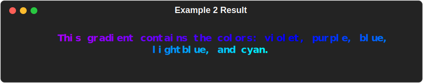

MaxGradient automates the printing gradient colored text to the console. It's built upon the great rich library. It contains a Console that can serve as a drop in replacement for rich.rich.Console and has an expanded Color class which can parse X11 color names on top of rich's standard colors. MaxGradient is a work in progress and I'm open to any suggestions or contributions.

<h1 class="rainbow-wipe">Installation</h1>

MaxGradient can be installed from PyPi using your favorite python package manager:

## <span class="pdm-wipe">PDM (Recommended)</span>

```shell
pdm add maxgradient
```

## <span class="pdm-wipe">PIP</span>

```shell
pip install maxgradient
```

---

<h1 class=rainbow-wipe>Usage</h1>

## <span class="pdm-wipe">Quick Start</span>

The basic usage is to create a console object and use it to print gradient text. MaxGradient.Console is a drop in replacement for rich.rich.Console and can be used in the same way. It does, however, have some additional methods like <span class="green-wipe"> gradient</span><span class="black">()</span>.

<h2 class="pdm-wipe">Example</h2>

```python
#import console from MaxGradient
import maxgradient as mg

console = mg.Console() # Initialize a console
console.gradient(
    "Hello, World!",
    justify = "center"
)
```


## <span class="cool-wipe">Gradient with Color</span>

<p>MaxGradient easily make random gradients that require no more than the text you wish to color, it can also be used to make gradients with specific colors. The <span class="green">gradient</span><span class="white">()</span> method takes a string of text as well as a list of colors. The number of colors in the list determines the number of colors in the gradient. The gradient will be evenly distributed between the colors in the list. The gradient will be applied to the text in the order it is given in the list.</p>

<p>MaxGradient accepts the following as </p>
<ul>
    <li>color names (<span style="color:#ff0000">red</span>, <span style="color:#ff8800;">orange</span>, <span style="color:#ffff00;">yellow</span>, <span style="color:#0f0;">green</span>, <span style="color:#0ff;">cyan</span>, <span style="color: #08f;">lightblue</span>, <span style="color:#00f;">blue</span>, <span style="color:#5f00ff;">purple</span>, <span style="color:#af00ff;">violet</span>, <span style="color:#f0f;">magenta</span>)</li>
    <li>hex color codes (3-digit -> <span style="color:#f0f;">#f0f</span>, 6-digit -> <span style="color:#f0f;">#ff00ff</span>)</li>
    <li>rgb color codes</li>
    <li>X11 named colors</li>
    <li>as well as any colors from rich's standard library.</li>
</ul>

<p>Let's take a look at some examples:</p>

<!--Code Block Start | 1 -->

### <span class="pdm">Example 1</span>

```python
import maxgradient as mg

console = mg.Console() # Initialize a console
console.gradient(
    "This gradient contains the colors: magenta, violet, and purple.",
    colors = [
        "magenta",
        "violet",
        "purple"
    ])
```


<!--Result | 1 -->

<br /><hr><br />

<!--Code Block Start | 2 -->

### <span class="pdm">Example 2</span>

You are not just stuck with ROY G BIV colors, you can use any colors you want. Let's make a gradient with the colors: magenta, violet, purple, blue, lightblue, and cyan.

```python
console.gradient(
    "This gradient contains the colors: magenta, violet, purple, blue, lightblue, and cyan.",
    colors = [
        "rgb(255,0,255)", # rgb | magenta
        "violet", # named
        "#5f00ff", # hex | purple
        "blue", # another named
        "rgb(0, 136, 255)", # rgb | lightblue
        "cyan" # and another
    ]
)
```



<!--Result End | 2 -->

---

## Changelog

### v0.2.4

- Rewrote `MaxGradient.console.Console` to replicate `rich.console.Console`
    - added `gradient` method
    - added `gradient_rule` method
- Switched to [`ruff`](https://docs.astral.sh/ruff/) for linting
- Pruned dependencies
- Updated default_styles.GRADIENT_STYLES

### v0.2.3

- Updated docs and added more examples and reference
- Fixed bugs
    - Fixed bug where gradient would not print if gradient was the only thing in the console
    - Fixed bug where gradient wouldn't print if the style wasn't a `rich.style.Style` object

### v0.2.2

- Added examples to docs and fixed some typos and bugs
- Disabled logging
- Fixed gradient class
- Added gradient rules
