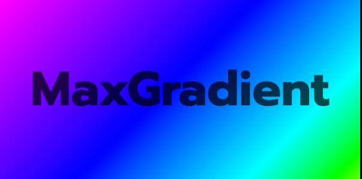

<!---->

MaxGradient automates the printing gradient colored text to the console. It's built upon the great rich library. It contains a Console that can serve as a drop in replacement for rich.rich.Console and has an expanded Color class which can parse X11 color names on top of rich's standard colors. MaxGradient is a work in progress and I'm open to any suggestions or contributions.

# Installation

MaxGradient can be installed from PyPi using your favorite python package manager:

## PDM (Recommended)

<pre><code>pdm add maxgradient</code></pre>

## PIP

<pre><code>pip install maxgradient</code></pre>

# Usage

## Quick Start

The basic usage is to create a console object and use it to print gradient text. MaxGradient Console is a drop in replacement for rich.rich.Console and can be used in the same way. It does, however, have some additional methods like gradient().

<pre><code># import console from MaxGradient
import maxgradient as mg

console = mg.Console()
console.gradient("Hello, World!")
</code></pre>

<figure>
    <figcaption class="twotwelve">Produces the following:</figcaption>
    
</figure>

## Gradient with Color

MaxGradient easily make random gradients that require no more than the text you wish to color, it can also be used to make gradients with specific colors. The gradient() method takes a string of text as well as a list of colors. The number of colors in the list determines the number of colors in the gradient. The gradient will be evenly distributed between the colors in the list. The gradient will be applied to the text in the order it is given in the list.

We'll talk a low level look at MaxGradient.color.Color but you can use:

<ul>
    <li>color names</li>
    <li>hex color codes</li>
    <li>rgb color codes</li>
    <li>X11 named colors</li>
    <li>as well as any colors from rich's standard library.</li>
</ul>