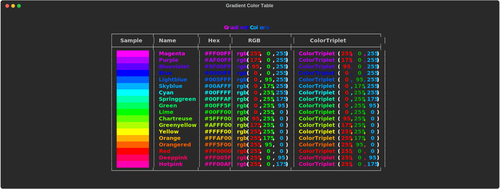

# Possible Colors

## Gradient Colors

???+ note Gradient Colors

    When not provided a list of colors, MaxGradient will generate a random gradient from the following colors:

## Rich Standard Colors

???+ note Rich Standard Colors

    MaxGradient supports all of the rich library's standard color names as well as the their hex color codes, RGB color codes, as well as RGB color tuples.

