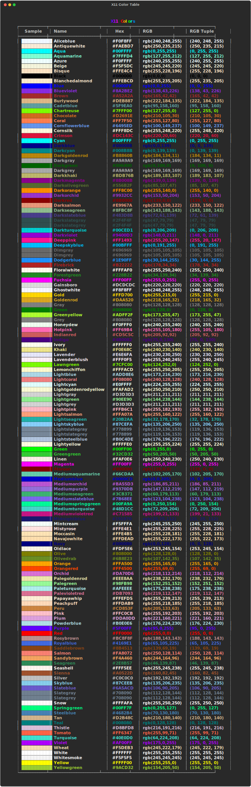

# Possible Colors

## Gradient Colors

---

## Rich Standard Colors

MaxGradient supports all of the Rich Standard Colors:

??? note "Rich Color Accepted Formats"
    Can parse rich colors in multiple formats:

    - Name: Case insensitive.
    - HEX: Case insensitive.
    - RGB: With or without the `rgb` prefix.
    - RGB: With or without spaces between the numbers.

    | Type   |              Example 1                            |               Example 2                         |                     Example 3                              |
    | :----: | :------------------------------------------------ | :---------------------------------------------- | :--------------------------------------------------------- |
    | Name   | grey93  (case insensitive)    | Salmon1 | Spring-green1        |
    | Hex    | #eeeeee  (case insensitive) | #FF875F | #00ff87                   |
    | RGB    | (238,238,238) (without 'rgb') | rgb(255,135,95) (with 'rgb') | rgb(0, 255, 135)  (with spaces)  |

## X11 Colors

MaxGradient also supports all of the X11 color names as well as the their hex color codes, RGB color codes, as well as RGB color tuples.

